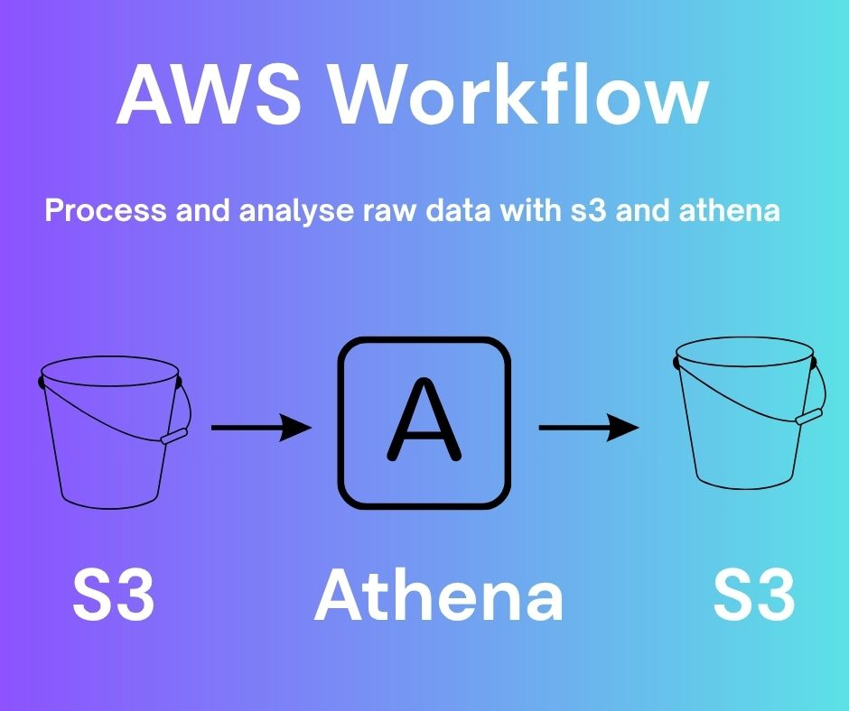

# Aws-Athena-Aws-bucket

# 📊 AWS Data Pipeline (S3 → Athena → S3)

## 🚀 Overview
This project demonstrates a simple and efficient data pipeline using AWS.  
The pipeline takes raw CSV data, stores it in Amazon S3, queries it using Amazon Athena, and saves the results back to S3.  

This workflow is ideal for lightweight data analysis and reporting without complex infrastructure.

---

## 🏗️ Architecture / Workflow

**Flow:**  
Raw Data → S3 (Raw Layer) → Athena (Query Layer) → S3 (Results Layer)

---

## ⚙️ Tools & Services
- **Amazon S3** – Store raw and processed data  
- **Amazon Athena** – Query data using SQL  

---

## 📂 Project Pages

